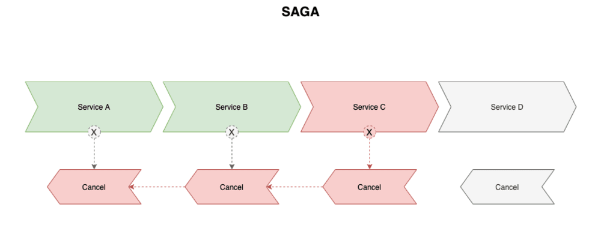

# POC Pattern SAGA

## **Descrição**

O design pattern Saga é um padrão de projeto utilizado para controlar transações distribuídas, que envolvem diversas operações em diferentes sistemas e serviços distribuidos. Ele foi criado para lidar com situações em que uma transação precisa ser executada em diferentes serviços e sistemas, onde cada um tem sua própria base de dados e não há um único ponto de controle centralizado.

O design pattern Saga divide uma transação em uma série de etapas, onde cada etapa é executada em um serviço diferente. Cada etapa é representada por uma transação local e possui seu próprio compensador, que é responsável por reverter a operação caso algo dê errado. Dessa forma, se uma etapa falhar, o compensador correspondente é acionado para desfazer a operação e garantir que a transação como um todo seja revertida.

O padrão Saga é uma alternativa ao padrão de commit de duas fases, que é mais centralizado e pode causar problemas de escalabilidade e disponibilidade em sistemas distribuídos. Com o padrão Saga, cada serviço é responsável por sua própria transação e compensação, o que torna o sistema mais resiliente e escalável.

#### Observações
O Intuito desse padrão não é desfazer todas as transações caso ocorra qualquer erro.
O ideal e desfazer as alterações caso seja um erro do qual os sistemas não consigam ser recuperar.

### Legenda

* Compensador
Técnica usada para desfazer uma transação que já foi confirmada. 

# Stack
- Java
- Spring Cloud
- MySQL
- Kafka
- Modules
- Maven

#### Descrição do projeto
Este projeto simula um ecommerce onde uma transação passa por vários serviços.
Para simplificar esses serviços são representados por módulos nessa aplicação